# MOSB Logistics Dashboard - 시스템 아키텍처 문서

**작성일**: 2026-01-08
**프로젝트**: MOSB Logistics Live Map MVP v2
**버전**: 1.0

---

## 목차

1. [시스템 개요](#시스템-개요)
2. [아키텍처 다이어그램](#아키텍처-다이어그램)
3. [시스템 구성 요소](#시스템-구성-요소)
4. [데이터 흐름](#데이터-흐름)
5. [인증/인가 아키텍처](#인증인가-아키텍처)
6. [기술 스택](#기술-스택)
7. [배포 아키텍처](#배포-아키텍처)

---

## 시스템 개요

MOSB Logistics Dashboard는 실시간 물류 추적 및 운영 관리를 위한 웹 기반 대시보드입니다.

### 핵심 기능

- **실시간 지도 시각화**: Deck.gl + MapLibre 기반 지도 표시
- **물류 데이터 관리**: Locations, Shipments, Legs, Events 추적
- **실시간 이벤트 스트리밍**: WebSocket 기반 실시간 업데이트
- **역할 기반 접근 제어**: JWT + RBAC 기반 보안
- **성능 최적화**: 서버/클라이언트 캐싱

---

## 아키텍처 다이어그램

### 전체 시스템 아키텍처

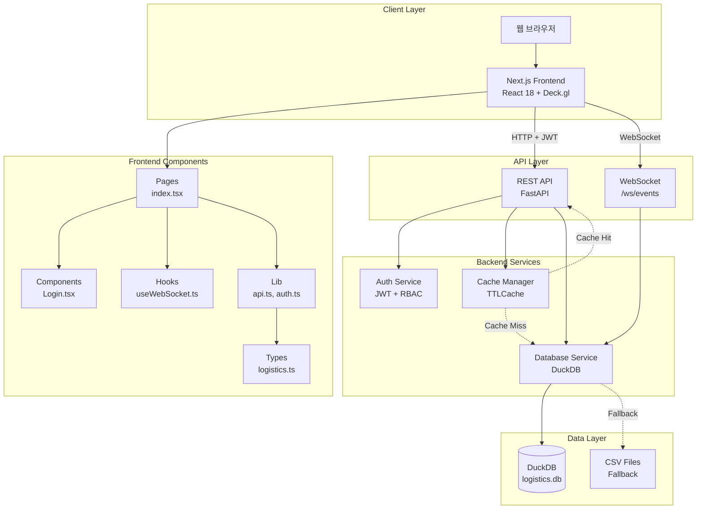

### 컴포넌트 상호작용 다이어그램

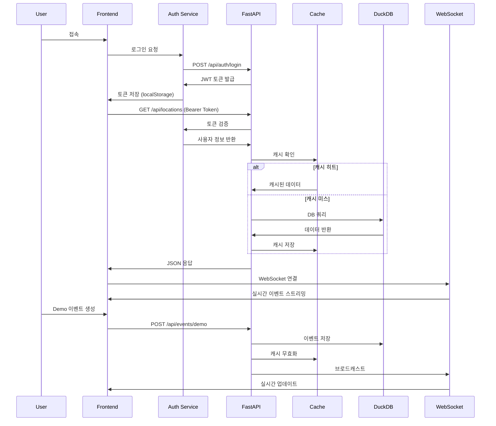

### 데이터 모델 관계도

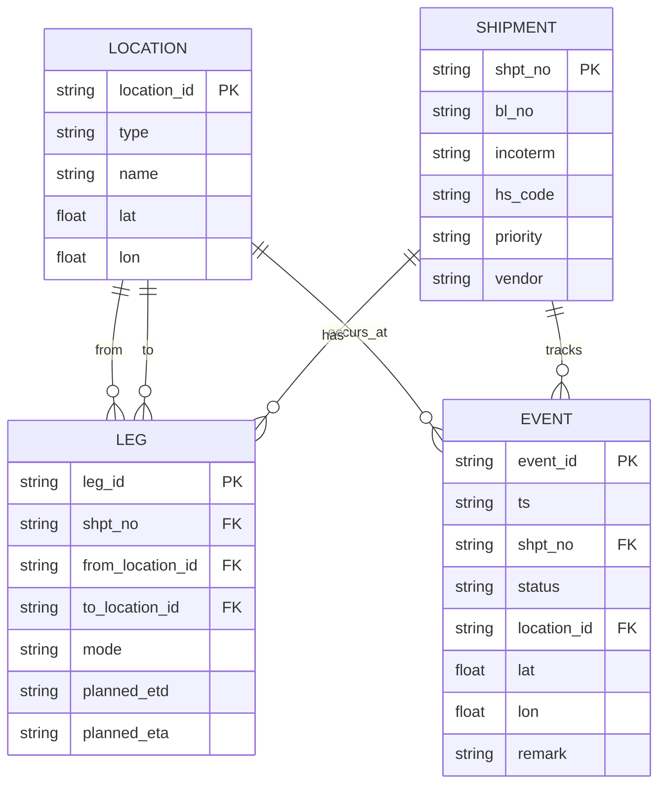

---

## 시스템 구성 요소

### Frontend (Next.js)

#### 1. 페이지 컴포넌트

**`pages/index.tsx`**
- 메인 대시보드 페이지
- 인증 상태 관리
- 지도 시각화 (Deck.gl)
- KPI 표시
- 이벤트 타임라인

#### 2. 컴포넌트

**`components/Login.tsx`**
- 로그인 폼
- 사용자 인증 UI
- 에러 처리

#### 3. 라이브러리

**`lib/api.ts`**
- REST API 클라이언트
- 인증 헤더 자동 추가
- 에러 처리

**`lib/auth.ts`**
- 인증 서비스
- 토큰 관리
- 사용자 정보 캐싱
- 역할 체크 헬퍼

#### 4. 훅

**`hooks/useWebSocket.ts`**
- WebSocket 연결 관리
- 자동 재연결
- 메시지 파싱

#### 5. 타입 정의

**`types/logistics.ts`**
- 도메인 타입 정의
- TypeScript 인터페이스

### Backend (FastAPI)

#### 1. 메인 애플리케이션

**`main.py`**
- FastAPI 앱 인스턴스
- 엔드포인트 정의
- 미들웨어 설정
- 예외 처리

#### 2. 인증/인가

**`auth.py`**
- JWT 토큰 생성/검증
- 비밀번호 해싱
- 사용자 인증
- 토큰 검증 의존성

**`rbac.py`**
- 역할 기반 접근 제어
- 권한 검사 데코레이터

#### 3. 데이터 계층

**`db.py`**
- DuckDB 연결 관리
- 스키마 초기화
- CSV 데이터 로드
- CRUD 작업

**`models.py`**
- Pydantic 모델 정의
- 데이터 검증

#### 4. 캐싱

**`cache.py`**
- TTLCache 관리
- 캐시 무효화
- 캐시 데코레이터

---

## 데이터 흐름

### 1. 로그인 플로우

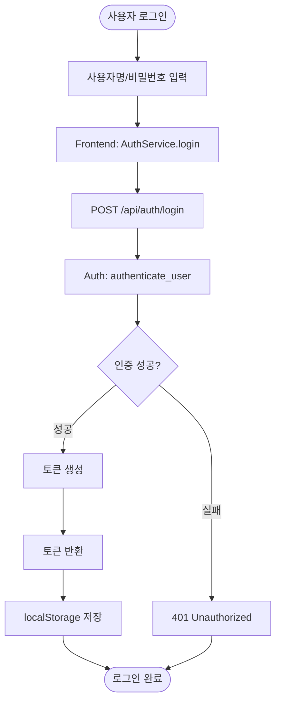

### 2. 데이터 조회 플로우

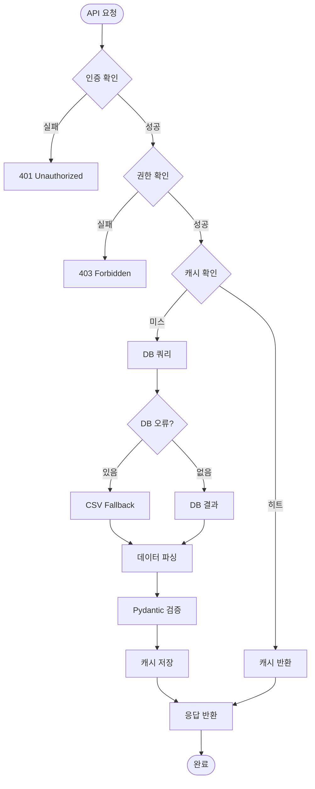

### 3. 실시간 이벤트 플로우

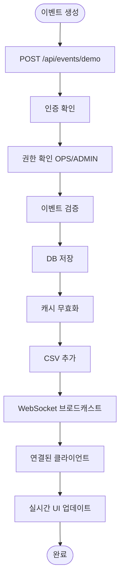

---

## 인증/인가 아키텍처

### JWT 토큰 구조

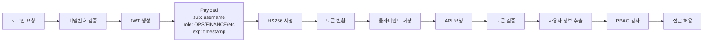

### 역할 기반 접근 제어 (RBAC)

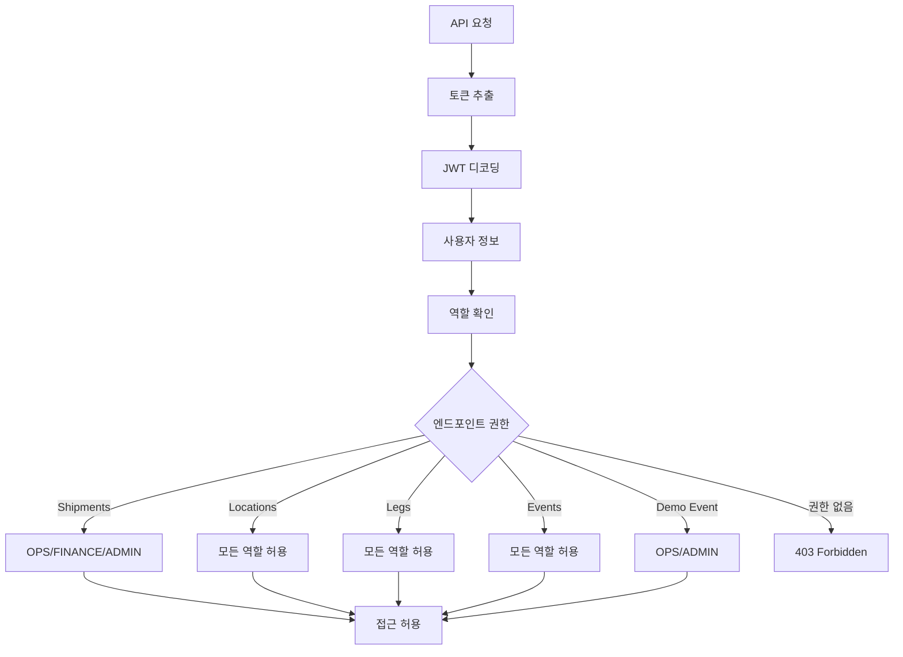

### 인증 미들웨어 체인

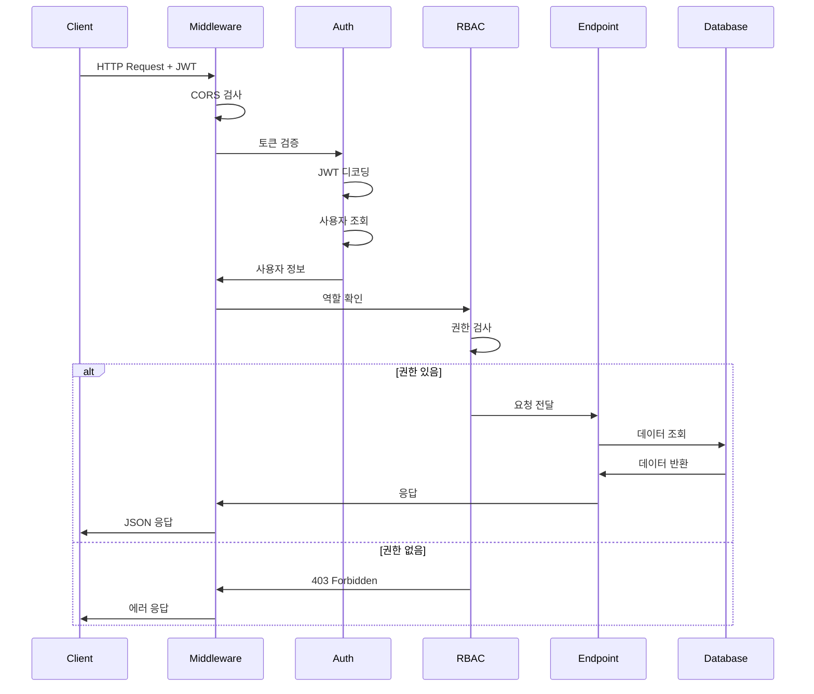

---

## 기술 스택

### Frontend

| 계층 | 기술 | 버전 | 용도 |
|------|------|------|------|
| Framework | Next.js | 14.2.0 | React 프레임워크 |
| UI Library | React | 18.2.0 | UI 컴포넌트 |
| Map Engine | Deck.gl | 9.0.0 | 지도 레이어 렌더링 |
| Map Provider | MapLibre | 4.0.0 | 지도 타일 제공 |
| Language | TypeScript | 5.0.0 | 타입 안전성 |

### Backend

| 계층 | 기술 | 버전 | 용도 |
|------|------|------|------|
| Framework | FastAPI | 0.119.0 | REST API 서버 |
| ASGI Server | Uvicorn | 0.30.0 | 비동기 서버 |
| Database | DuckDB | 1.3.2 | 데이터 저장 |
| Caching | cachetools | 5.5.0 | 메모리 캐싱 |
| Validation | Pydantic | 2.0.0 | 데이터 검증 |
| Auth | python-jose | 3.3.0 | JWT 처리 |
| Password | passlib | 1.7.4 | 비밀번호 해싱 |

### 인프라

| 항목 | 기술 | 용도 |
|------|------|------|
| 데이터 저장 | DuckDB + CSV | 파일 기반 DB |
| 실시간 통신 | WebSocket | 이벤트 스트리밍 |
| 배포 | (계획) | Docker, CI/CD |

---

## 배포 아키텍처

### 현재 구조 (개발 환경)

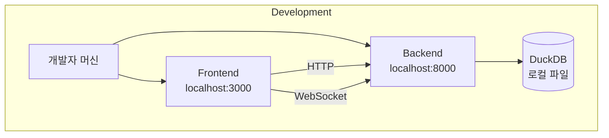

### 프로덕션 구조 (계획)

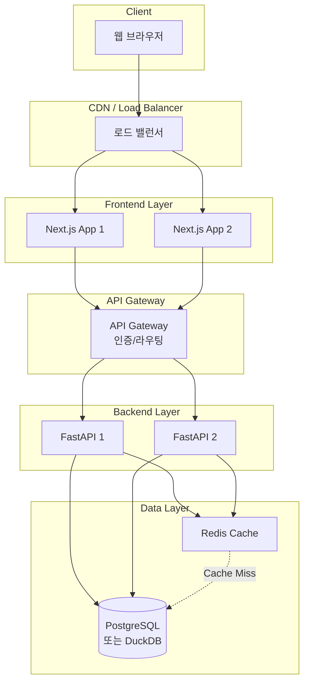

---

## 보안 아키텍처

### 인증/인가 플로우

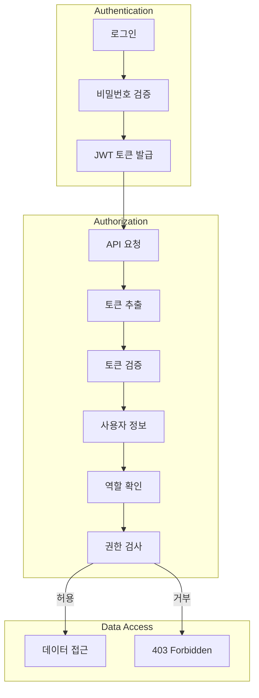

### 보안 계층

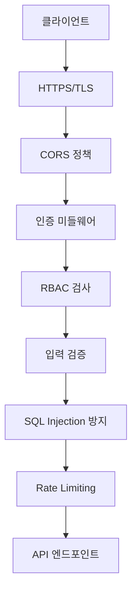

---

## 성능 아키텍처

### 캐싱 전략

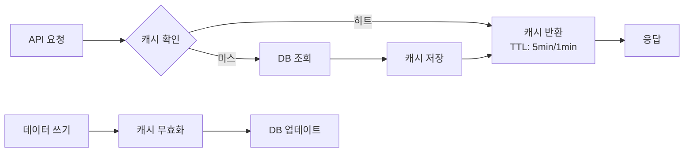

### 성능 최적화 포인트

1. **서버 캐싱**
   - Locations/Shipments/Legs: 5분 TTL
   - Events: 1분 TTL
   - 캐시 히트율: 약 50% (예상)

2. **클라이언트 최적화**
   - React 메모이제이션
   - 코드 스플리팅
   - 이미지 최적화

3. **데이터베이스**
   - 인덱스 활용
   - 쿼리 최적화
   - 배치 처리

---

## 확장성 고려사항

### 수평 확장

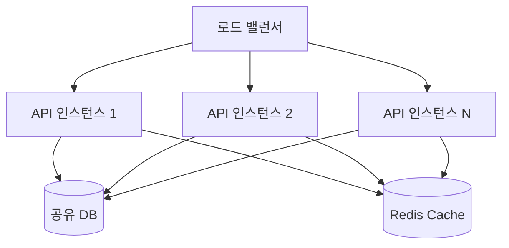

### 데이터베이스 마이그레이션 경로

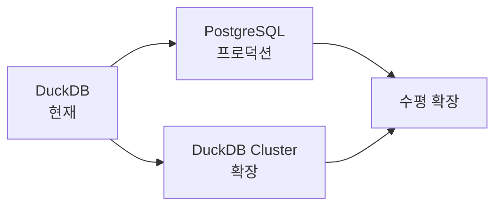

---

## 모니터링 및 로깅

### 로깅 계층

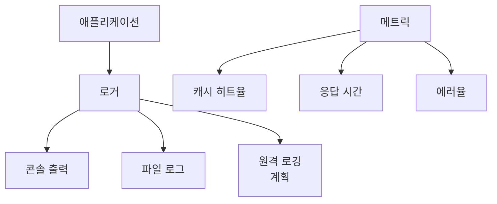

---

## API 엔드포인트 구조

### REST API

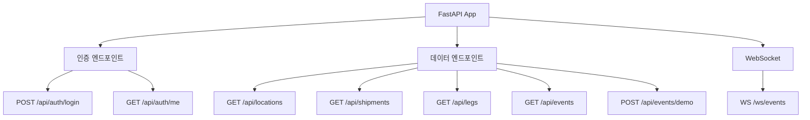

---

## 데이터 저장 전략

### 계층화된 저장소

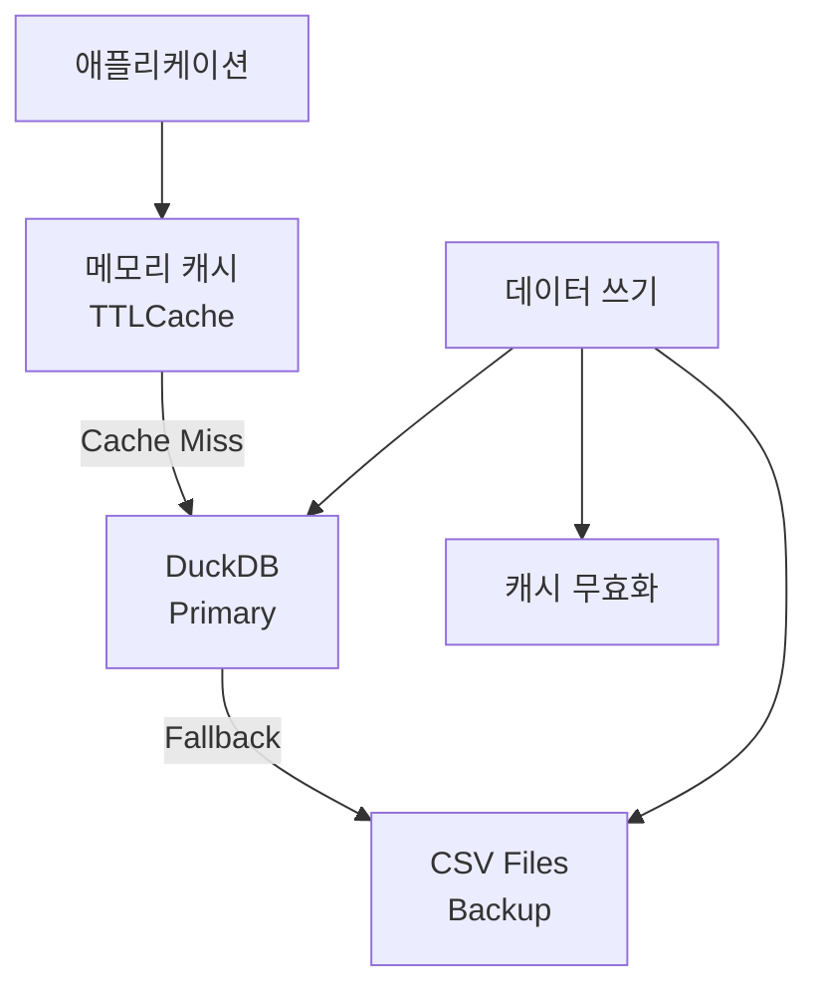

---

## 변경 이력

- **2026-01-08**: 초기 아키텍처 문서 작성
- **2026-01-08**: Phase 3.1, 3.2 반영

---

**문서 버전**: 1.1
**최종 업데이트**: 2026-01-08
